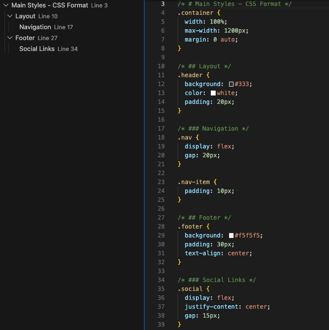

# Mokuji - 目次ジェネレーター

ファイル内のコメントや見出しを使って、サイドバーに目次（Mokuji）を表示するVS Code拡張機能です。

[English README](README.md)



## 機能

- 特別なコメント形式や見出しを認識し、階層的な目次を自動生成
- サイドバーに見やすいツリービューで表示
- 目次項目をクリックして、該当のコード行へ即座にジャンプ
- ファイル編集時にリアルタイムで目次を更新

## 対応言語

| 言語 | 形式 | 例 |
|------|------|-----|
| CSS | ブロックコメント | `/* # Section */` |
| SCSS/LESS | 行コメント | `// # Section` |
| HTML | HTMLコメント | `<!-- # Section -->` |
| Markdown | ネイティブ見出し | `# Section` |

## 使用方法

### CSS / SCSS / LESS

```css
/* # メインセクション */
.main {
  color: blue;
}

/* ## サブセクション */
.sub {
  color: red;
}
```

```scss
// # メインセクション
.main {
  color: blue;
}

// ## サブセクション
.sub {
  color: red;
}
```

### HTML

```html
<!-- # ヘッダーセクション -->
<header>
  <!-- ## ナビゲーション -->
  <nav>...</nav>
</header>

<!-- # メインコンテンツ -->
<main>...</main>
```

### Markdown

```markdown
# メインタイトル

## セクション1

### サブセクション1.1

## セクション2
```

### 階層レベル

`#` 記号で階層の深さを指定します（最大6レベル）：

- `#` = レベル1
- `##` = レベル2
- `###` = レベル3
- 以降同様...

### 目次の表示

1. 対応ファイル（CSS、SCSS、LESS、HTML、Markdown）を開く
2. アクティビティバーの「Mokuji」アイコンをクリック
3. サイドバーに目次が表示されます
4. 目次項目をクリックすると、該当行へジャンプします

## インストール

### VS Code Marketplaceから

VS Codeの拡張機能ビューで「Mokuji」を検索してインストール。

### 開発版の実行

1. このリポジトリをクローン
2. `npm install` で依存関係をインストール
3. `npm run compile` でコンパイル
4. F5キーを押してExtension Development Hostを起動

## 開発

```bash
# 依存関係のインストール
npm install

# TypeScriptのコンパイル
npm run compile

# ウォッチモード（自動コンパイル）
npm run watch
```

## ライセンス

MIT
